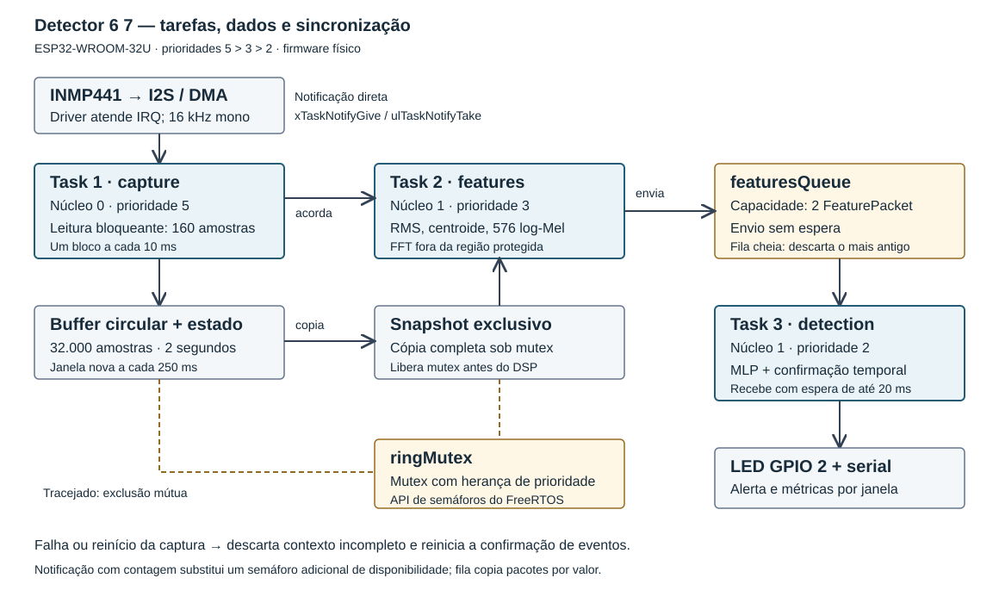

# Relatório técnico - Detector de Anomalias Acústicas

## 1. Objetivo e aplicação

O projeto implementa a detecção local das expressões “seis sete” e “six seven”, conforme a liberdade de escolha do padrão acústico prevista no [enunciado](<../Detector de Anomalias Acústicas.pdf>). O caso de uso proposto é um comando de ativação por voz em um dispositivo embarcado: reconhecer uma sequência curta e sinalizar sua ocorrência sem enviar o áudio para um serviço de reconhecimento de fala.

O alvo é a sequência direta de duas palavras. Números isolados, ordem invertida e outras expressões são exemplos negativos. O modelo é supervisionado e binário; não transcreve a fala, não identifica o locutor e não garante rejeitar todos os sons desconhecidos. As duas línguas compartilham a classe positiva.

## 2. Hardware e captura

A montagem utiliza uma placa de desenvolvimento com módulo ESP32-WROOM-32U, INMP441, breadboard, LED e resistor de 220 Ω. O buzzer é opcional no enunciado e está desabilitado nesta implementação (`buzzer = -1`).

| Componente / sinal | Conexão no ESP32 |
|---|---|
| INMP441 VDD | 3V3 |
| INMP441 GND | GND |
| INMP441 L/R | GND |
| INMP441 SCK / BCLK | GPIO 14 |
| INMP441 WS / LRCL | GPIO 27 |
| INMP441 SD | GPIO 32 |
| LED | GPIO 2 → resistor 220 Ω → ânodo; cátodo → GND |

Os números identificam GPIOs, não posições físicas do conector. L/R permanece baixo para selecionar o canal esquerdo; WS é um sinal alternado gerado pelo periférico I2S. O conector de antena externa da variante WROOM-32U não participa da captura de áudio.

O ESP32 é mestre I2S, com taxa de 16 kHz e palavras de 32 bits por canal. A configuração final lê os dois canais intercalados e extrai `raw[2*i] >> 16`, correspondente ao slot0 identificado no teste da montagem. O fluxo entregue ao DSP é mono PCM16 a 16 kHz. Os blocos têm 160 amostras mono, correspondentes a 10 ms; a transferência estéreo ocupa 1.280 bytes por bloco.

Durante a integração, a leitura mono anterior produzia RMS zero. O firmware `mic_test` mostrou sinal variável no slot0 e apenas valores brutos 0/1 no slot1, sem erros ou perdas. A captura estéreo com extração explícita do slot0 resolveu a leitura na montagem, conforme confirmação do autor. Esse resultado fundamenta a configuração adotada, mas não demonstra isoladamente a causa interna do comportamento do modo mono.

Código: [audio_input.h](../firmware/include/audio_input.h), [mic_diagnostic.h](../firmware/include/mic_diagnostic.h) e [config.h](../firmware/include/config.h).

## 3. Arquitetura RTOS e concorrência



| Tarefa | Prioridade | Núcleo | Pilha configurada | Responsabilidade |
|---|---:|---:|---:|---|
| `capture` | 5, alta | 0 | 4.096 bytes | Leitura bloqueante de I2S/DMA e alimentação do buffer circular |
| `features` | 3, média | 1 | 8.192 bytes | Snapshot da janela, extração de características e envio à fila |
| `detection` | 2, baixa | 1 | 6.144 bytes | Inferência, confirmação temporal, LED e telemetria |

O driver atende as interrupções I2S e movimenta dados por DMA. A tarefa de captura recebe os blocos com `i2s_read`; ela não implementa processamento pesado dentro de uma ISR. O buffer circular guarda 32.000 amostras, ou 2 segundos. Após o preenchimento inicial, uma janela é disponibilizada a cada 4.000 amostras novas, ou 250 ms. Portanto, quatro análises por segundo continuam contendo dois segundos de contexto cada uma.

### Sincronização e conflitos resolvidos

- **Acesso simultâneo ao buffer:** `ringMutex`, criado com `xSemaphoreCreateMutex`, protege amostras, índices, contadores e timestamps. A tarefa de features copia a janela para um snapshot próprio e solta o mutex antes da FFT. A herança de prioridade do mutex limita a inversão de prioridade durante a região crítica.
- **Disponibilidade da janela:** `xTaskNotifyGive` acorda a tarefa de features, que aguarda em `ulTaskNotifyTake`. É uma notificação direta com contagem, sem um semáforo binário adicional. Os valores `filled` e `sequence` são conferidos sob mutex; notificações acumuladas não obrigam o processamento de janelas antigas.
- **Entrega das características:** `featuresQueue` armazena até dois `FeaturePacket`, copiados por valor. O produtor usa envio sem espera; se a fila estiver cheia, remove o pacote mais antigo antes de enviar o recente. O consumidor aguarda até 20 ms por pacote.
- **Sobrecarga:** `skipped` contabiliza janelas não processadas e `queue_drops` contabiliza remoções da fila. A captura não espera pela inferência. A pequena suspensão da tarefa de features oferece oportunidade de execução à detecção e à tarefa idle.
- **Interrupção do áudio:** falha de leitura, overflow DMA ou reinício da fonte limpa o preenchimento da janela. Um identificador de época reinicia a confirmação de eventos, evitando unir decisões de trechos descontínuos.
- **Saída compartilhada:** somente a tarefa de detecção controla o alerta no firmware normal. A captura e o DSP não modificam o LED.

Os buffers circular e de snapshot ocupam 64.000 bytes cada e são alocados uma vez na inicialização. O cálculo espectral usa memória própria da tarefa de features; não há alocação dinâmica por janela no caminho normal do DSP. A ausência de processamento pesado sob mutex e a separação dos núcleos favorecem a continuidade da captura. Não foi realizada prova formal de tempo real estrito.

Código da arquitetura: [main.cpp](../firmware/src/main.cpp).

## 4. Características e modelo pré-treinado

Cada janela de 2 segundos é dividida em frames de 400 amostras (25 ms), com salto de 160 amostras (10 ms). O processamento remove a média de cada frame, aplica janela Hann e FFT de 512 pontos. A potência espectral alimenta 24 filtros Mel entre 80 e 7.600 Hz. O logaritmo dessas energias é agregado em 24 posições temporais, resultando em **576 características log-Mel**.

A posição temporal é preservada para representar a ordem das palavras. O código também calcula RMS da janela e centroide espectral médio, publicados na telemetria. Esses dois valores são diagnósticos; a entrada do classificador é o vetor log-Mel. Não são calculados MFCCs: o projeto usa log-Mel como a representação espectral prevista pela possibilidade de extrair características como RMS, centroide e outras no enunciado.

O classificador é uma MLP de 576 entradas, 32 neurônios ocultos ReLU e uma saída sigmoide. O treinamento usa `StandardScaler` ajustado apenas no treino, Adam, regularização `alpha=0.01`, semente 67, balanceamento por reamostragem do treino e duas versões aumentadas por gravação de treino. As alterações incluem ganho, ruído e deslocamento temporal limitado pelo espaço disponível.

Há limite de 150 épocas e parada após 20 épocas sem melhora da perda de validação. Na versão avaliada, foram executadas 39 épocas e escolhidos os pesos da época 19. O limiar foi ajustado na validação para maximizar recall respeitando a meta de falsos positivos de até 2% nesse conjunto. Essa meta não é uma garantia para dados novos.

O artefato [model.onnx](../modelo/model.onnx) contém normalização e rede. Entrada: `features`, float32, formato `[N,576]`; saída: `probability`, formato `[N,1]`. A extração do áudio não está dentro do ONNX. O ESP32 executa as mesmas operações em C++ com os pesos exportados em [model_data.h](../modelo/model_data.h), sem carregar um runtime ONNX. O score não é uma probabilidade calibrada de acerto.

Limiar desta versão: **0,3917484879**. Um evento requer duas janelas consecutivas acima ou iguais ao limiar, respeitando intervalo mínimo de 1,5 s entre eventos. Dois resultados negativos rearmam o detector; um intervalo de mais de 375 ms entre janelas quebra a consecutividade. O LED fica ativo por aproximadamente 250 ms, sujeito ao escalonamento da tarefa.

Código: [dsp.py](../src/detector67/dsp.py), [train.py](../src/detector67/train.py), [model.py](../src/detector67/model.py), [dsp.h](../firmware/include/dsp.h) e [inference.h](../firmware/include/inference.h).

## 5. Dataset e resultados por clipe

O conjunto local desta versão contém **74 gravações**, acima da sugestão inicial de 40. Os áudios são pessoais e não acompanham o repositório público. A organização simplificada usa duas pastas de treinamento, `positivo` e `negativo`, e reserva `teste` para avaliações adicionais fora do treino.

| Divisão | Positivos | Negativos | Total |
|---|---:|---:|---:|
| Treino | 20 | 26 | 46 |
| Validação | 6 | 8 | 14 |
| Teste | 6 | 8 | 14 |
| Total | 32 | 42 | 74 |

A divisão é por arquivo, aproximadamente 60/20/20, com identificação por hash das amostras decodificadas. O processo rejeita duplicatas exatas e preserva a divisão ao adicionar ou renomear gravações. Isso não elimina a semelhança entre áudios gravados na mesma sessão. Não há evidência suficiente para afirmar generalização para outras pessoas, ambientes ou microfones. A classe positiva reúne as duas línguas; não há métricas separadas por idioma nem por subtipo de negativo.

| Métrica | Validação | Teste |
|---|---:|---:|
| Precisão | 100,0% | 83,3% |
| Recall | 83,3% | 83,3% |
| F1 | 90,9% | 83,3% |
| Falsos positivos | 0 de 8 negativos | 1 de 8 negativos |
| Alvos perdidos | 1 de 6 positivos | 1 de 6 positivos |

Matriz de confusão do teste:

| Classe real | Predito negativo | Predito positivo |
|---|---:|---:|
| Negativo | 7 | 1 |
| Positivo | 1 | 5 |

Resultados extraídos do relatório do treinamento, preservados em [modelo.json](evidencias/modelo.json). O erro absoluto máximo observado entre scores NumPy e ONNX no conjunto de teste foi **1,788 × 10⁻⁷**. Essas métricas são por clipe e não equivalem à taxa de eventos corretos em operação contínua.

## 6. Latência medida no ESP32

Fonte: [esp32.jsonl](evidencias/esp32.jsonl), trecho de telemetria da placa física fornecido pelo autor após a correção da captura. Foram normalizados os escapes de Markdown nos nomes dos campos. São 65 janelas consecutivas, sequências 358 a 422, com 16 segundos entre o primeiro e o último timestamp de janela. O relatório calculado está em [latencia.json](evidencias/latencia.json).

| Etapa / campo | Média (ms) | P95 (ms) | Máximo observado (ms) |
|---|---:|---:|---:|
| Leitura de um bloco, `capture_read_us` | 9,983 | 9,983 | 9,983 |
| Escrita no buffer, `capture_copy_us` | 0,0132 | 0,014 | 0,014 |
| Extração de características, `features_us` | 174,631 | 174,646 | 174,647 |
| Espera na fila, `queue_us` | 0,0419 | 0,047 | 0,047 |
| Inferência, `inference_us` | 11,057 | 11,066 | 11,069 |
| Pipeline após a última leitura, `pipeline_us` | 185,999 | 186,018 | 186,043 |

As medições usam `esp_timer_get_time`, em microssegundos; a tabela converte para milissegundos. `capture_read_us` inclui a espera bloqueante por um bloco, não mede o tempo para adquirir os dois segundos de contexto. `capture_copy_us` inclui a espera pelo mutex e a escrita do bloco no buffer; não é o tempo da cópia integral do snapshot. `features_us` mede a extração após o snapshot. `pipeline_us` começa ao terminar a leitura do último bloco da janela e termina após a decisão e o eventual acionamento do LED; inclui esperas e cópias intermediárias e exclui a impressão serial posterior. Portanto, não deve ser calculado pela soma de todas as linhas da tabela.

No trecho, o máximo do pipeline ficou **63,957 ms abaixo** do intervalo de atualização de 250 ms. A extração de características é a etapa dominante. Os contadores `skipped`, `queue_drops` e `read_errors` permaneceram zero, e o heap livre informado ficou em **173.472 bytes**. Isso evidencia atendimento ao intervalo nessa amostra; não caracteriza WCET, estabilidade de longa duração nem garantia sob qualquer carga.

### Eventos e tempo de resposta

Foram emitidos dois eventos, nas sequências **368** e **421**. Antes do primeiro, os scores foram 0,90646 (seq. 367) e 0,98179 (seq. 368); o segundo ocorreu após 0,65767 (seq. 420) e 0,98815 (seq. 421). O comportamento observado corresponde à exigência de duas confirmações. Scores altos posteriores não repetem imediatamente o alerta enquanto o detector permanece desarmado.

A janela tem 2 segundos e o avanço entre decisões é 250 ms. O primeiro processamento só é possível após o preenchimento inicial. O pipeline de aproximadamente 186 ms não é a latência entre o início ou o fim da fala e o LED. Os logs não incluem marcação temporal independente da fala; por isso essa latência acústica não pode ser determinada na placa a partir deste trecho. Os dois eventos são evidência de funcionamento, não uma matriz de acerto do hardware.

## 7. Simulação e testes

[scripts/simulate.py](../scripts/simulate.py) monta uma sequência com os arquivos reservados de teste, em ordem aleatória reprodutível, separações de silêncio entre 2,5 e 4 segundos e uma cauda de 3 segundos. O script executa a mesma extração e decisão temporal em Python e mede tempos de features/inferência no computador, além de eventos e falsos alertas. As anotações do alvo são estimadas por energia e precisam de revisão manual para uma avaliação definitiva.

No cenário registrado de **66,775 s**, ocorreram seis eventos: cinco associados aos intervalos estimados de alvo, um falso positivo e um alvo perdido. O relatório contém uma taxa extrapolada de 53,913 falsos alertas/hora, calculada a partir de apenas um falso alerta nesse cenário curto; não é uma medição de uma hora nem uma estimativa robusta para uso real. A demora após o fim estimado dos cinco alvos detectados variou de 0,643 a 1,148 s. São resultados preliminares de replay no PC, não medidas de resposta da placa. Evidência: [simulacao.json](evidencias/simulacao.json).

O Wokwi oferece três fontes: tons sintéticos de demonstração; arquivos PCM incorporados ao firmware; e áudio do microfone do PC enviado por RFC2217. No último modo, a classificação ocorre no ESP32 simulado, com números de sequência, CRC e confirmação de recebimento. As interrupções reiniciam o contexto de áudio. Os tempos de simulação e de rede não substituem as medições do hardware físico.

A suíte em [tests](../tests) possui **19 testes aprovados** na verificação desta documentação. Ela cobre DSP, preservação da ordem temporal, decisões e rearme, divisão dos dados e duplicatas, treinamento/exportação, comparação de DSP e inferência C++ com Python/ONNX, geração de áudio Wokwi e protocolo de transmissão. Os dados sintéticos dos testes verificam o software; não validam reconhecimento de fala por si só.

Comandos de reprodução das verificações, em um ambiente Python com o projeto e suas dependências instalados:

```powershell
python -m pytest -q
python scripts/summarize_latency.py docs/evidencias/esp32.jsonl
python scripts/simulate.py --manifest data/manifest.csv --model modelo
```

Os testes automatizados criam seus próprios dados temporários. A reprodução do cenário de fala exige os áudios locais e o manifesto, que não fazem parte da entrega pública; o resultado observado está preservado em JSON. A latência pode ser recalculada diretamente com o log público, sem hardware.

## 8. Discussão e atendimento aos requisitos

O protótipo demonstrou captura contínua, processamento concorrente e emissão de eventos na montagem física. O uso de log-Mel com posição temporal permite representar a sequência das palavras, e a confirmação temporal reduz alertas repetidos. O conjunto pequeno deixa margem para erros, como o falso positivo e o alvo perdido no teste reservado. Melhorias devem ser avaliadas com novas gravações independentes, especialmente números isolados e expressões parecidas, sem ajustar repetidamente o modelo ao mesmo teste final.

| Requisito do PDF | Implementação / evidência |
|---|---|
| ESP32 + INMP441, captura contínua | I2S/DMA, buffer circular e teste físico; seções 2 e 6 |
| Modelo pré-treinado | MLP exportada em ONNX e pesos C++; seções 4 e 5 |
| Pelo menos três tarefas sincronizadas | Captura, features e detecção; seção 3 e SVG |
| Medir e documentar latência de cada etapa | Instrumentação do firmware, tabela e log de 65 janelas; seção 6 |
| Alerta LED/buzzer | LED GPIO 2; buzzer opcional desabilitado |
| Resolver conflitos de concorrência | Mutex, snapshot, notificação, fila limitada e tratamento de perdas; seção 3 |
| Código de teste com simulação e performance | `scripts/simulate.py`, `scripts/summarize_latency.py` e suíte `tests` |

## 9. Versão entregue e referências

A pasta [modelo](../modelo) preserva os arquivos da versão avaliada. SHA-256 do ONNX: `8608e67d417b9e72a69d439dfa0b8d17746cecdb650c29e897eec428c9ff4de9`. Alterar os pesos exige nova avaliação; números e evidências deste relatório não passam automaticamente a descrever um novo modelo.

- [Enunciado do projeto](<../Detector de Anomalias Acústicas.pdf>).
- [ESP32-WROOM-32D/32U - Espressif](https://documentation.espressif.com/esp32-wroom-32d_esp32-wroom-32u_datasheet_en.html).
- [INMP441 - datasheet do fabricante, cópia PDF](https://arduino.ua/files/INMP441.PDF).
- [I2S no ESP-IDF 4.4.7 - Espressif](https://docs.espressif.com/projects/esp-idf/en/v4.4.7/esp32/api-reference/peripherals/i2s.html).
- [Encaminhamento serial no Wokwi para VS Code](https://docs.wokwi.com/vscode/project-config#serial-port-forwarding).
